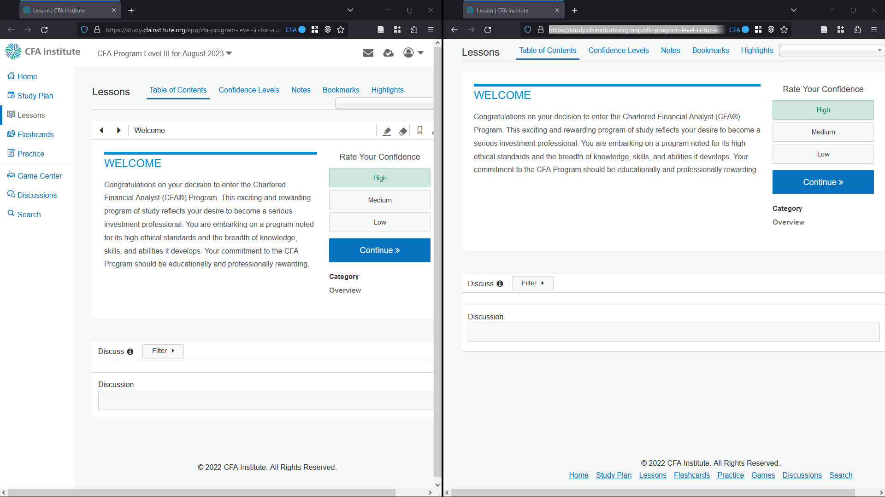

# DistractionFreeCFA
A browser extension that cleans up the CFA website's interface.

## Install

### Firefox
Download the .xpi file [here](https://github.com/henrystern/DistractionFreeCFA/releases/latest) and open it with firefox.

### Chrome
Download the zip file [here](https://github.com/henrystern/DistractionFreeCFA/releases/latest) and follow the instructions [here](https://superuser.com/questions/247651/how-does-one-install-an-extension-for-chrome-browser-from-the-local-file-system).
